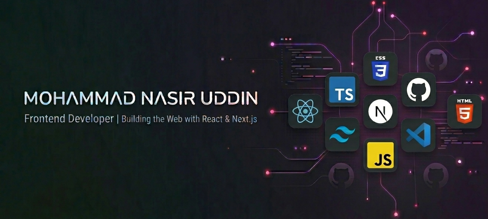

  

## 📖 About Me

I am a passionate **Self-taught Frontend Developer** specializing in **JavaScript, React, and Next.js**. I focus on building responsive web applications with clean UI and modern web experiences. My journey is driven by curiosity and a commitment to writing modular, maintainable, and user-centric code.

- 🚀 **Currently working on:** [Next Properties](https://github.com/your-username) and an **E-commerce Store**.
- 🌱 **Deeply exploring:** Next.js 15, TypeScript, and Prisma ORM.
- 🔭 **Goal:** Learning Node.js to evolve into a Full-Stack Developer.
- ⚡ **Fun fact:** I love minimalist desktop customization with Windhawk and Rainmeter.

---

## 🛠 Skills

I utilize a modern tech stack to build high-performance applications:

  

---

## 📊 GitHub Stats

---

## 🌐 Connect with Me

Feel free to reach out for collaborations or just a friendly chat about tech!

---

## 📌 Featured Projects

### 1. [Personal Portfolio](https://github.com/nasirmasud/nasirportfolio)

- **Overview:** A modern, interactive portfolio showcasing a journey from self-taught to bootcamp developer, featuring smooth animations and a sleek, responsive UI.
- **Tech Stack:** React, Tailwind CSS, Framer Motion.
- **Live Link:** [View Live Demo](https://nasirmasudportfolio.netlify.app/)

### 2. [Game Hub](https://www.google.com/search?q=https://github.com/nasirmasud/game-hub)

- **Overview:** A high-performance SPA powered by the RAWG API to explore 500,000+ games with real-time search and dynamic filtering.
- **Tech Stack:** React, TypeScript, Vite, Chakra UI, TanStack Query.
- **Live Link:** [View Live Demo](https://www.google.com/search?q=https://nasirmasud-gamehub.netlify.app/)

### 3. [NextWeather Dashboard](https://www.google.com/search?q=https://github.com/nasirmasud/next-weather)

- **Overview:** A minimalist weather application delivering precise real-time data and 5-day forecasts with intelligent search and geolocation support.
- **Tech Stack:** Next.js 15, TypeScript, TanStack Query, Jotai, Tailwind CSS.
- **Live Link:** [View Live Demo](https://www.google.com/search?q=https://nasir-next-weather.vercel.app/)

### 4. [TechWave Podcast](https://github.com/nasirmasud/B13-A02/)

- **Overview:** A modern podcast landing page designed to highlight tech episodes, community metrics, and host information with a clean, engaging interface.
- **Tech Stack:** HTML5, CSS3, Responsive Design.
- **Live Link:** [suspicious link removed]

### 5. [GitHub Issue Tracker](https://github.com/nasirmasud/B13-A05)

- **Overview:** A streamlined issue management dashboard featuring status filtering, real-time search, and color-coded priority visualization.
- **Tech Stack:** HTML5, CSS3, JavaScript, API Integration.
- **Live Link:** [suspicious link removed]
