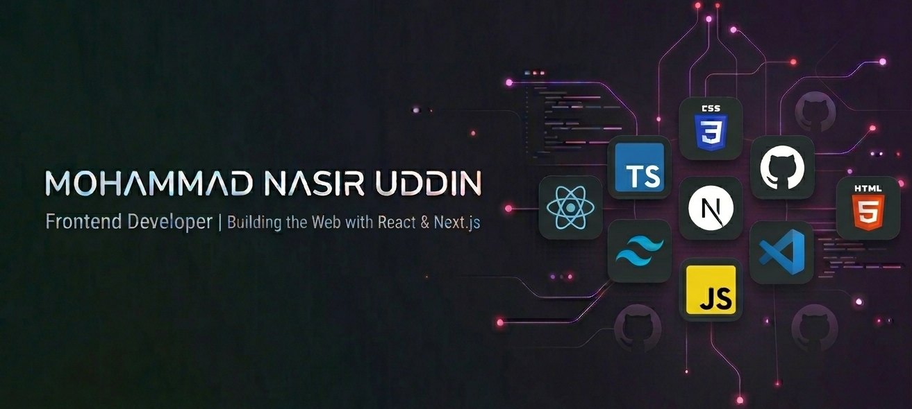

  

# Mohammad Nasir Masud

**Full-Stack Developer — Next.js, TypeScript, Node.js, MongoDB.** I design and ship complete web products: authentication, role-based access, payments, and real databases — not front-end demos.

  
  
  
  

  <a href="#-about">About</a> · <a href="#-tech-stack">Stack</a> · <a href="#-featured-projects">Projects</a> · <a href="#-how-i-work">How I Work</a> · <a href="#-github-stats">Stats</a> · <a href="#-connect">Connect</a>

---

## About

I'm a self-taught developer working from Dhaka, Bangladesh. I started in the browser — HTML, CSS, JavaScript — and kept pulling the thread backwards until I was comfortable owning the server, the schema, and the payment flow. That path is why my projects tend to be complete products rather than interface exercises.

Most of my work is marketplace-shaped: buyers, sellers, mentors, and admins sharing one database with different permissions. Auth, RBAC, search and filtering, dashboards, and payments are the parts I care most about getting right.

Outside of work I keep a heavily customised Windows desktop — Windhawk, Rainmeter, minimal.

## Currently

- 🔭 Building an **e-commerce store** and **Next Properties**
- 🌱 Deepening **Node.js/Express architecture**, **Prisma + PostgreSQL**, and TypeScript beyond the type-checking basics
- 🎯 Moving from frontend into full-stack delivery — smaller surface area, more ownership

---

## Tech Stack

**Frontend**

  

**UI & Styling** — shadcn/ui, HeroUI, DaisyUI, Figma, responsive CSS architecture

**Backend & Data**

  

**Auth & Payments** — BetterAuth (sessions, role-based access), Stripe Checkout

**Tooling**

  

---

## Featured Projects

### ⚑ Fable — E-book Marketplace

**A full-stack digital marketplace connecting readers, writers, and administrators.**

Stripe-powered purchases, role-specific dashboards for each side of the platform, and an architecture that keeps catalogue, orders, and payouts in separate domains instead of one growing `products` table.

- 💳 End-to-end Stripe checkout and webhook-driven order fulfilment
- 🔐 Three-role access model — reader, writer, admin — enforced server-side, not just hidden in the UI
- 🧩 Domain-separated feature folders so catalogue, orders, and payouts stay independently maintainable
- ✨ Interface work in Tailwind CSS 4 + shadcn/ui with Framer Motion for state and layout transitions
- 🗄 Express + MongoDB data layer behind a Next.js 16 (React 19) front end

       

**[→ Live demo](https://fable-amber.vercel.app)**

### Other Builds

<table>
  <tr>
    <td width="50%" valign="top">

**MediQueue — Medical Tutoring Marketplace**

A booking platform where medical students find 1-on-1 mentors and reserve real slots. Search filters narrow by subject and availability, slot management stays consistent under concurrent booking, and access is split between student, mentor, and admin.

    

**[→ Live demo](https://b13-a9-client.vercel.app)**

    </td>
    <td width="50%" valign="top">

**Skill Sphere — Learning Platform**

A course-discovery platform with authenticated accounts, catalogue browsing, and enrolment flow. Built to prove I can ship the unglamorous parts — session handling, empty states, responsive layouts — and still get the details right.

    

**[→ Live demo](https://b13-a8.vercel.app)**

    </td>
  </tr>
</table>

---

## How I Work

- **I model the data before the pixels.** Roles, permissions, and API shape get decided while the database is still an empty collection. Rewriting an auth model after the UI exists is the expensive way round.
- **A feature isn't done until the edges work.** Loading, empty, error, and unauthorised states are part of the ticket, not a follow-up.
- **Boring technology, chosen deliberately.** I reach for the tool I can debug at 2am, and I only add something unfamiliar when the project is the reason to learn it.
- **Security is part of the feature, not a phase.** Server-side authorisation checks, validated input, and no secrets shipped to the client — even in projects that never leave localhost.

---

<strong>📊 GitHub Stats & Activity</strong>

 

  
  

  

 

**Contribution Activity**

  

 

**Contribution Graph**

  

 

**Trophy Case**

  

 

**Contribution Snake**

<picture>
  <source media="(prefers-color-scheme: dark)" srcset="https://raw.githubusercontent.com/nasirmasud/nasirmasud/output/github-contribution-grid-snake-dark.svg"/>
  <source media="(prefers-color-scheme: light)" srcset="https://raw.githubusercontent.com/nasirmasud/nasirmasud/output/github-contribution-grid-snake.svg"/>
  
</picture>

---

## Connect

  
  
  
  
  

  Open to freelance projects and collaborations. If you have a marketplace, booking, or dashboard product in mind — or just want to compare approaches — email me and I'll reply.

---

  
  

