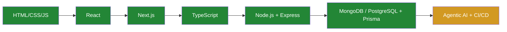

<div align="center">
  
</div>

<h1 align="center">Hi, I'm Mohammad Nasir Uddin 👋</h1>
<p align="center"><b>Full-Stack Developer</b> · React · Next.js · TypeScript · Node.js</p>

<p align="center">
  
  
</p>

## 📖 About Me

I build scalable, high-performance web applications with clean UI and maintainable code. I started as a self-taught frontend developer and have grown into full-stack work: REST APIs, authentication, payments, and databases, all shipped to production.

- 🚀 **Recently built:** MindAgent (multi-agent AI platform), Fable (e-book marketplace), SkillBridge (freelance marketplace)
- 🌱 **Deeply exploring:** Next.js App Router, TypeScript, Prisma ORM, Agentic AI
- 💬 **Ask me about:** React, Next.js, Tailwind CSS, Express + MongoDB, role-based dashboards
- ⚡ **Fun fact:** I love minimalist desktop customization with Windhawk and Rainmeter

```typescript
const nasir: Developer = {
  role: "Full-Stack Developer",
  location: "Chattogram, Bangladesh",
  stack: {
    frontend: ["JavaScript (ES6+)", "React", "Next.js", "TypeScript", "Tailwind CSS"],
    backend: ["Node.js", "Express", "MongoDB", "PostgreSQL", "Prisma"],
    state: ["Zustand", "TanStack Query", "Context API"],
  },
  learning: ["Agentic AI", "CI/CD", "System design"],
  languages: ["Bengali", "English", "Arabic (basic)", "Hindi (basic)"],
  goal: "Join a growth-focused team and ship products people enjoy using",
};
```

---

## 🛠 Skills

**Frontend**


**Backend & Database**


**Tools & Design**


---

## 🧭 Roadmap


```mermaid
graph LR
    A[HTML/CSS/JS] --> B[React]
    B --> C[Next.js]
    C --> D[TypeScript]
    D --> E[Node.js + Express]
    E --> F[MongoDB / PostgreSQL + Prisma]
    F --> G[Agentic AI + CI/CD]

    style A fill:#238636,color:#fff
    style B fill:#238636,color:#fff
    style C fill:#238636,color:#fff
    style D fill:#238636,color:#fff
    style E fill:#238636,color:#fff
    style F fill:#238636,color:#fff
    style G fill:#d29922,color:#fff
```

🟢 Done · 🟡 In progress

---

## 📌 Featured Projects

### 1. MindAgent – AI Productivity Platform


- **Overview:** Multi-agent AI platform for content, image, data analysis, and chat. Real-time AI streaming, JWT and Google OAuth, secure file analysis, and responsive analytics dashboards.
- **Tech Stack:** Next.js 15, React 19, TypeScript, Express.js, MongoDB, Tailwind CSS, TanStack Query, OpenRouter AI, Zod, Multer, Recharts.
- **Links:** [Live Demo](https://github.com/nasirmasud) · [Client](https://github.com/nasirmasud) · [Server](https://github.com/nasirmasud) <!-- TODO: replace the three links with the real URLs -->

### 2. [Fable – E-book Marketplace](https://fable-amber.vercel.app)


- **Overview:** Role-based marketplace where writers publish, monetize, and manage digital books. Includes bookmarking, purchase tracking, and analytics dashboards.
- **Tech Stack:** Next.js, React, Express.js, MongoDB, Better Auth, Google OAuth, Stripe, Tailwind CSS, Framer Motion, shadcn/ui.
- **Links:** [Live Demo](https://fable-amber.vercel.app) · [Client](https://github.com/nasirmasud) · [Server](https://github.com/nasirmasud) <!-- TODO: replace Client/Server links -->

### 3. SkillBridge – Freelance Service Marketplace


- **Overview:** Connects clients with freelancers. Protected role-based dashboards for services, users, categories, and orders, with search, filtering, pagination, analytics, and dark mode.
- **Tech Stack:** React 19, TypeScript, Vite, Tailwind CSS, TanStack Query, Zustand, React Router, Node.js, Express.js, PostgreSQL, Prisma, JWT, Zod, shadcn/ui.
- **Links:** [Live Demo](https://github.com/nasirmasud) · [Client](https://github.com/nasirmasud) · [Server](https://github.com/nasirmasud) <!-- TODO: replace the three links with the real URLs -->

<details>
<summary><b>More projects</b></summary>

- **[MediQueue](https://b13-a9-client.vercel.app)**: Medical tutoring marketplace with mentor search, real-time slot booking, and role-based access. *(Next.js 16, BetterAuth, MongoDB, TanStack Query)*
- **[Skill Sphere](https://b13-a8.vercel.app)**: Learning platform with secure auth and dynamic course discovery. *(Next.js 16, HeroUI, BetterAuth, MongoDB)*

</details>

---

## 🎓 Education & Certifications

- **Training:** Complete Web Development Bootcamp, Programming Hero (Batch 13)
- **Certification:** Responsive Web Design, freeCodeCamp
- **Education:** Electrical & Electronics Engineering (IEB, 3 years coursework) · Diploma in Computer Technology, Mymensingh Polytechnic Institute

---

## 📊 GitHub Stats

<p align="left">
  
</p>

---

## 🌐 Connect with Me

Open to collaborations, opportunities, or a friendly chat about tech.

<p align="left">
  <a href="https://linkedin.com/in/mohammadnasirmasud">
    
  </a>
  <a href="https://nasirmasud-portfolio.netlify.app">
    
  </a>
  <a href="mailto:nasir.masud@ymail.com">
    
  </a>
</p>

---

<p align="center">
  
</p>

<picture>
  <source media="(prefers-color-scheme: dark)" srcset="https://raw.githubusercontent.com/nasirmasud/nasirmasud/output/github-snake-dark.svg" />
  <source media="(prefers-color-scheme: light)" srcset="https://raw.githubusercontent.com/nasirmasud/nasirmasud/output/github-snake.svg" />
  
</picture>
</document_content>
